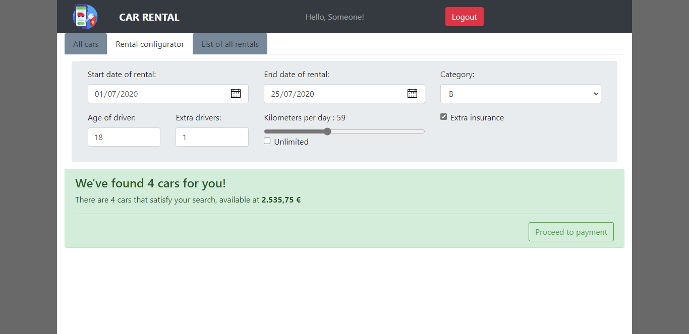

# Exam #1: "Car rental"
## Student: s270079 BRESSANI ROBERTO

## React client application routes

- Route `/`:  will redirect to `/cars`
- Route `/cars`: main page that shows all the cars, that can filter by category and brand
- Route `/login`: login page (together with `/`, is the only one accisible to non logged users)
- Route `/config`: configurator page
- Route `/config/payment`: page that manages the payment. If no selection has been performed, it will redirect to `/config`.
- Route `/rentals`: page that provides all the rentals performed by the logged user

## REST API server

All the REST APIs will begin with `/api` (omitted in the following part)

### "Public" APIs (accessible without authentication token)

- GET `/cars` 
  - no request body and parameters
  - response with the full car set
- GET `/brands`
  - no request body and parameters
  - response with all brands
- POST `/login`
  - request body with username and password
  - if successful will set the cookie and return the username
- GET `/login`
  - no request body and parameters, it is used to check whether the user is logged in or not
  - if user is already  logged in, it will return the username

### "Private" APIs (accessible only with authentication token)

- GET `/logout`
  - no request body and parameters
  - empty response, only clears the cookie
- GET `/configuration` 
  - request URL contains the requested configuration parameters as in the example:
`/configuration?start=2020-06-22&end=2020-06-22&category=A&kilometer=0&unlimited=true&age=18&extra_drivers=0&insurance=false`
  - response body contains the available cars
- GET `/rentals?ended=true|false` 
  - no request body, params indicates whether the requested rentals are the future ones or the historical ones
  - response body contains the list of rentals matching the search for the logged user
- POST `/pay`
  - request body contains credit card and amount to pay
  - no response body, only status code is meaningful

### TO BE implemented yet

- POST `/rentals` [requires authentication]
  - request body with rental configuration (+ selected car) and payment infos (a single request is performed) to perform a new rental for the logged user
  - empty body (status code is meaningful)

- DELETE `/rentals/:id`
  - no request body, only GET parameters indicating the id of the rental to delete
  - no response body (status code is meaningful)

## Server database

- Table `cars` - contains data about car rental's car:
 >cars(	__id__ , category, brand, model)
- Table `users` - contains infos about registered users:
 > users(__id__, username, email,  password)
- Table `rentals` - contains info about rentals:
 > rentals(__id__, car_id, user_id, start_day, end_day, driver_age, extra_drivers, extra_insurance, kilometer, unlimited_km, price )

## Main React Components

<!--TODO add components -->
- `ListOfSomething` (in `List.js`): component purpose and main functionality
- `GreatButton` (in `GreatButton.js`): component purpose and main functionality
- ...

(only _main_ components, minor ones may be skipped)

## Screenshot

<!--TODO add screen shot -->

## Test users

* sample@gmail.com, "password"
* username, password
* username, password (frequent customer)
* username, password
* username, password (frequent customer)
